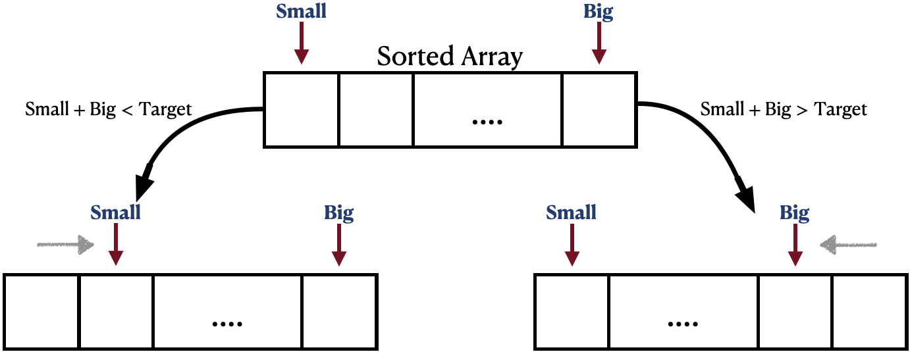

# My Problem Solving Submissions Editorial #
Hello there! :smiley: If you're searching for a place to learn how to solve problems, and not just find the answers, then I have great news for you :sparkles: - you've come to the right place :books:! 

My name is Mohammadreza, and in this repository, I will do my best to explain my LeetCode submissions. I want to clarify that the solution I am sharing is not the only way to solve the problem, and perhaps **not the best** way! However, I believe it is easy to code, learn, and remember for future use. I'll share my thought process :thought_balloon: as I tackle a problem, and I'll help you follow the same procedure for similar questions. 

I suggest spending :hourglass: ***at least one hour*** :hourglass: trying to solve the problem yourself before checking out my editorial if you're unable to solve it. Doing so will help you understand better and improve your problem-solving skills after each attempt :chart_with_upwards_trend:. 

I hope that you find this repository helpful :white_check_mark:.

***

## My "General Procedure :trollface: " for Problem Solving ##
1. **DO NOT RUSH**:grey_exclamation:   It is important to read the problem description carefully and precisely, even when you are in a programming competition with a time limit. Rushing through the description can cause you to misunderstand the problem, and as a result, you may end up spending more time coding the wrong answer than it would take to figure out what the question really wants. Thus, taking your time to understand the problem is essential for success.
2. **Remeber** the similar problem 💡 **Remember** the idea 💡   This is the key step that helps you get the `Accepted`, and get better at problem-solving over time. After reading the problem description, start recalling similar questions you've solved before. Try to remember the idea you used to solve them and explain in one sentence why the current question requires a similar approach.
3. Challenge Acce......pted :heavy_check_mark:   Consider the constraints given in the problem description. Check the time limit and memory limit. Make sure the combination of your idea and the constraints satisfies the limits. By this point, you must have figured out how exactly this problem challenges you and what is your approach to tackling it. Do not ignore this. Only by doing this, you can make sure you are ready to start coding.
4. Code it and Get Accepted, then **THINK On It!** :shipit:   Once you've got the "Accept", there is one final step to complete. You need to come up with a label for the idea behind this problem. You don't have to only use formal or well-known labels like "DP" or "Greedy". Instead, use any label that will help you remember how you solved the problem in the future. By working through the problems in this repository, you'll become more familiar with this concept.
***

## Table of contents :page_facing_up:
(easy: :small_blue_diamond:, medium::small_orange_diamond:, hard::small_red_triangle:)
1. [LeetCode: Two Sum](#twosum) :small_blue_diamond: 
 
:dart:idea
  Two Pointers, Sort 

2. [LeetCode: Best Time to Buy and Sell Stock](#besttimetobuyandsellstock) :small_blue_diamond: 
 
:dart:idea
  Optimization, One Traverse 

3. [LeetCode: Contains Duplicate](#containsduplicate) :small_blue_diamond: 
 
:dart:idea
  Sort, big O 

4. [LeetCode: Product of Array Except Self](#productofarrayexceptself) :small_orange_diamond: 
 
:dart:idea
 Partial Sum 

5. [LeetCode: Maximum Subarray](#maximumsubarray) :small_orange_diamond: 
 
:dart:idea
 DP 

6. [LeetCode: Maximum Product Subarray](#maximumproductsubarray) :small_orange_diamond: 
 
:dart:idea
 DP 

***

### 1. LeetCode: Two Sum Problem [[Link]](https://leetcode.com/problems/two-sum/ "LeetCode Submission Link") 

#### Description

Given an array of integers nums and an integer target, return indices of the two numbers such that they add up to target.
You may assume that each input would have exactly one solution, and you may not use the same element twice.
You can return the answer in any order.

Example 1:   Input: `nums = [2,7,11,15], target = 9`   Output: `[0,1]`   Explanation: Because nums[0] + nums[1] == 9, we return [0, 1].   Example 2:   Input: `nums = [3,2,4], target = 6`   Output: `[1,2]`   Example 3:   Input: `nums = [3,3], target = 6`   Output: `[0,1]`

Constraints:   2 $\le$ `nums.length` $\le$ 104   -109 $\le$ `nums[i]` $\le$ 109   -109 $\le$ `target` $\le$ 109   + Only one valid answer exists.
####

#### Editorial

It's natural to consider the approach of `brute force` when faced with this problem. Since the input array is not sorted, we need to scan the entire array for each element to find the other element that makes up the target. As a result, the time complexity of this approach would be $O(n^2)$. As we move on to the third step of my general approach, it becomes clear that this approach is bound to result in a time-limit error. Additionally, we have to keep track of the indexes of elements, which means any operation that moves and swaps the elements is a challenge.

Following the `brute force` idea, it would be great if we didn't have to walk through the entire array for each element  $O(n^2)$ . What does it require to find the answer only in one pass over the array $O(n)$ ? This means we can only perform one comparison for each element. However, the challenge is to determine the right element to calculate their sum and check if it matches the `target`. If the array was sorted, we could use the two-pointer idea by having one pointer at the start and the other at the end of the array. By comparing their sum with the `target`, we could identify the next best pair to consider. For example, if their sum is less than the `target`, we would need to consider a pair with a larger sum, and by moving the pointer that points to the smaller element one step to the right, we can be sure that we have achieved the next larger sum available in the entire array.

Sorting an array of elements seems to be difficult if you also need to keep track of their indexes, but there is a simple solution to this problem. If you require both sorting and index tracking, you can pair each element with its index and then sort the resultant array of pairs. 

Although we need only $O(n)$ to traverse through the sorted array of pairs using two pointers, sorting the array itself requires a $O(n \ log \ n)$. Still, this is good enough to get the `Accept`.

##

### 2. LeetCode: Best Time to Buy and Sell Stock [[Link]](https://leetcode.com/problems/two-sum/](https://leetcode.com/problems/best-time-to-buy-and-sell-stock/) "LeetCode Submission Link") 

#### Description

You are given an array `prices` where `prices[i]` is the price of a given stock on the ith day.
  You want to maximize your profit by choosing a single day to buy one stock and choosing a different day in the future to sell that stock.   Return the maximum profit you can achieve from this transaction. If you cannot achieve any profit, return `0`.

Example 1:   Input: `prices = [7,1,5,3,6,4]`   Output: `5`   Explanation: Buy on day 2 (price = 1) and sell on day 5 (price = 6), profit = 6-1 = 5.   Note that buying on day 2 and selling on day 1 is not allowed because you must buy before you sell.   Example 2:   Input: `prices = [7,6,4,3,1]`   Output: `0`   Explanation: In this case, no transactions are done and the max profit = 0.
 
Constraints:   1 $\le$ `prices.length` $\le$ 105   0 $\le$ `prices[i]` $\le$ 104  

####

#### Editorial
We use the label "Optimization" to refer to problems that require finding the maximum, minimum, best, most, or similar terms. As soon as you identify a problem as an optimization problem, the first solution that should come to your mind is to solve it by traversing the array once. Sometimes, additional ideas like "DP" may be required to solve the problem during this traverse. At other times, the problem may be simpler than you initially thought.

This is an example of an easy problem where we need to find two elements from an array such that their difference is maximum. However, the order of these two elements matters. In fact, this is the only small challenge of this problem that the profit is calculated by subtracting the element with smaller index from the second element. Otherwise, by traversing the array only once, we can find the minimum and maximum element of the array, which would result in the maximum difference. 

To do this, as we traverse over the array, we must keep track of the minimum element seen so far, and calculate the global max profit as the maximum of itself and local profit which is the difference between the current element and the minimum element so far (which would be in the previous locations).

##

### 3. LeetCode: Contains Duplicate [[Link]](https://leetcode.com/problems/contains-duplicate/ "LeetCode Submission Link") 

#### Description

Given an integer array nums, return true if any value appears at least twice in the array, and return false if every element is distinct.
 
Example 1:  
Input: `nums = [1,2,3,1]`  
Output: `true`  
Example 2:  
Input: `nums = [1,2,3,4]`  
Output: `false`  
Example 3:  
Input: `nums = [1,1,1,3,3,4,3,2,4,2]`  
Output: `true`  

Constraints:  
1 $\le$ `nums.length` $\le$ 105  
-109 $\le$ `nums[i]` $\le$ 109  

####

#### Editorial

This is one of the simplest problems I have encountered on LeetCode. However, I wanted to include it in my repository because of the way I approached and solved it within 2 seconds. In many cases, you can arrive at the idea of solving a problem by considering the "big O" of the algorithm that would be accepted. For example, since the constraints allowed for $O(n\log \ n)$, I decided to use "Sort" as it is also $O(n\log \ n)$. If a problem requires $O(log \ n)$, then I would first consider "Binary Search" as it maps to $O(log \ n)$ in my mind. This is a helpful technique that you can use to figure out what idea to implement for the problem you are trying to solve.

If we sort the array ( $O(n\log \ n)$ ), all duplicate elements will become neighbors. Therefore, we can traverse the array once, and check if there exists an element that is equal to its neighbor. 

There are alternative techniques, such as utilizing "set" or ..., that may speed up the code. However, what I aimed to grasp from this problem, was to extract the idea from the big O the problem says it's fine to use.

##

### 4. LeetCode: Product of Array Except Self [[Link]](https://leetcode.com/problems/product-of-array-except-self/ "LeetCode Submission Link") 

#### Description

Given an integer array  nums , return an array `answer` such that `answer[i]` is equal to the product of all the elements of nums except `nums[i]`.  
The product of any prefix or suffix of nums is guaranteed to fit in a 32-bit integer.  
You must write an algorithm that runs in O(n) time and without using the division operation.

Example 1:  
Input: `nums = [1,2,3,4]`  
Output: `[24,12,8,6]`  
Example 2:  
Input: `nums = [-1,1,0,-3,3]`  
Output: `[0,0,9,0,0]`  
 
Constraints:  
2 $\le$ `nums.length` $\le$ 105  
-30 $\le$ `nums[i]` $\le$ 30  
The product of any prefix or suffix of nums is guaranteed to fit in a 32-bit integer.  

####

#### Editorial
This problem has three main challenges. First, the solution must have a runtime complexity of $O(n)$, which means we need to consider ideas like creating an extra array, traversing once over the `nums` array, or using dynamic programming. Secondly, the problem states that we cannot use the division operation. This means that we cannot find the product of the entire `nums` array and then divide the total product by each element. Instead, we must calculate the answer for each element `curr` by computing the product of the elements before and after `curr`. Finally, `0` is a tricky number in this problem. If there is exactly one `0` in `nums`, then the output will only have one non-zero element. If `nums` has more than one `0`, then the entire output will be zeros. Apart from these, this problem is pretty straightforward. However, the idea we use to solve it is quite useful and can be applied to many other problems.

"Partial Sum" refers to a general idea in which we create an array `ps`. Each `ps[i]` equals elements `arr[0]` to `arr[i-1]` of another array. I've used the partial sum idea in many problems. To solve this problem, we create two arrays: `pre` and `aft`. `pre[i]` is the product of `nums[0]` to `nums[i-1]`, while `aft[i]` is the product of `nums[i+1]` to `nums[last]` where `last` is the last element. To fill the output array, we multiply each element of `pre` with the corresponding element of `aft`. This algorithm has a runtime of $O(n)$ and handles the other two challenges mentioned.

##

### 5. LeetCode: Maximum Subarray [[Link]](https://leetcode.com/problems/maximum-subarray/ "LeetCode Submission Link") 

#### Description

Given an integer array nums, find the subarray with the largest sum, and return its sum.

Example 1:  
Input: `nums = [-2,1,-3,4,-1,2,1,-5,4]`  
Output: `6`  
Explanation: The subarray [4,-1,2,1] has the largest sum 6.  
Example 2:  
Input: `nums = [1]`  
Output: `1`  
Explanation: The subarray [1] has the largest sum 1.  
Example 3:  
Input: `nums = [5,4,-1,7,8]`  
Output: `23`  
Explanation: The subarray [5,4,-1,7,8] has the largest sum 23.  
 

Constraints:  
1 $\le$ `nums.length` $\le$ 105  
-104 $\le$ `nums[i]` $\le$ 104  

####

#### Editorial

This was one of the first "not easy" dynamic programming problems I solved, but it taught me a lot about this paradigm. The first step is to recognize it is a DP problem. How? Read the Dynamic Programming post [[Link]](https://github.com/mhdr-hami/Problem-Solving/blob/main/DynamicProgramming.md "Dynamic Programming post Link") . 

Solving the maximum subarray problem, like any other DP problem, can be challenging until you discover its "secret". To solve this problem, we need to determine the smaller or simpler form of the problem.  The key is to divide the solution into sub-groups and use them to solve the main problem. For example, one way to do this is to check if a subarray contains the element `nums[i]` or not. This makes sub-groups and helps us determine whether having an element in one subarray means anything or not. Another way is to consider any subarray that starts or ends with an element `nums[i]` for each element in `nums`.

The key to solving this problem is to group all subarrays based on their last element. Each group, denoted as `i`, includes all the subarrays that end with the element `nums[i]`. By determining the maximum sum of all subarray in each group as `dp[i]`, we can iterate through all of them and take their maximum as the solution.

Let's begin with `nums[0]`. The only subarray in the group of subarrays that ends with `nums[0]` is `nums[0]` itself. So, the first step is straightforward. `dp[0]` is equal to `nums[0]`. 

Next, the subarrays that end with `nums[1]` are the subarray `[nums[0], nums[1]]` and `nums[1]` itself. The maximum sum of elements among these two, which is `dp[1]`, is the greater value between `nums[0]+nums[1]` and `nums[1]`. To find a correlation between `dp[1]` and `dp[0]`, we can substitute `nums[0]` with `dp[0]` as they are equal. Thus, `dp[1]` is equal to the greater value between `dp[0]+nums[1]` and `nums[1]`.

From this, we may tackle how to find the secret. Assume we want to find `dp[n-1]` and we've already calculated `dp[n-2]`. Any subarray that ends with `nums[n-1]` is either `nums[n-1]` itself or a subarray in group `dp[n-2]` that `nums[n-1]` is added to it. Hence, the maximum sum in group `dp[n-1]` is either created by adding `nums[n-1]` to the answer of group `dp[n-2]` or by considering `nums[n-1]` by itself. That's it. We just found our secret. 

`dp[i] = max(nums[i]+dp[i-1], nums[i])`

All is left to do is to create the `dp` array, and take maximum element in that.

##

### 6. LeetCode: Maximum Product Subarray [[Link]](https://leetcode.com/problems/maximum-product-subarray/ "LeetCode Submission Link") 

#### Description

Given an integer array nums, find a subarray that has the largest product, and return the product.

The test cases are generated so that the answer will fit in a 32-bit integer.

Example 1:  
Input: `nums = [2,3,-2,4]`  
Output: `6`  
Explanation: [2,3] has the largest product 6.  
Example 2:  
Input: `nums = [-2,0,-1]`  
Output: `0`  
Explanation: The result cannot be 2, because [-2,-1] is not a subarray.  
 
Constraints:  
1 $\le$ `nums.length` $\le$ 2 * 104  
-10 $\le$ `nums[i]` $\le$ 10  
The product of any prefix or suffix of nums is guaranteed to fit in a 32-bit integer.  
