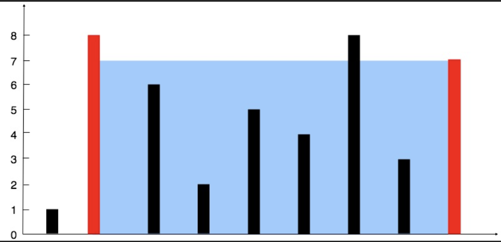
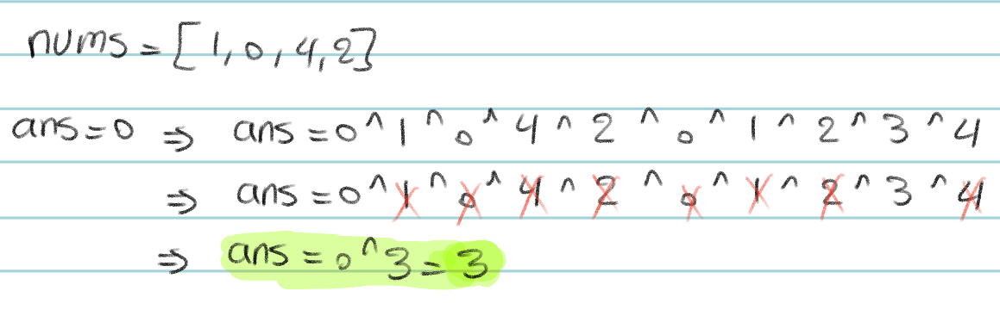
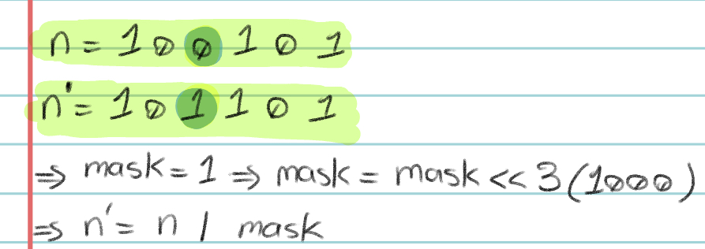
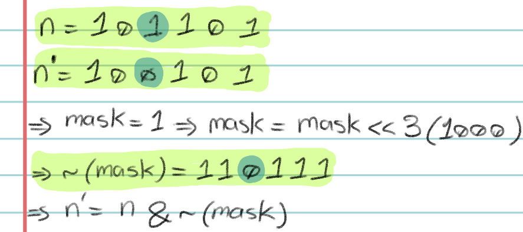
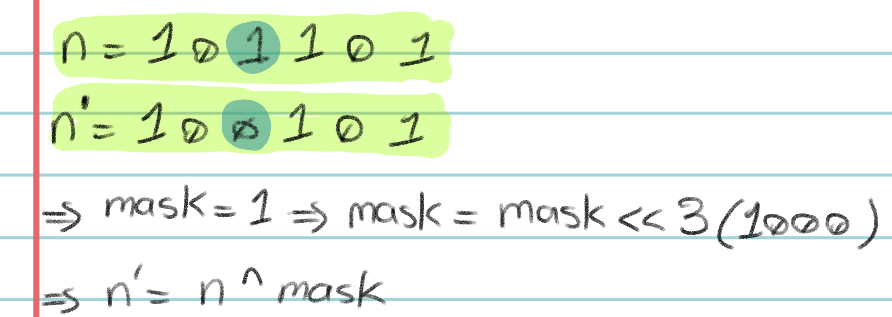
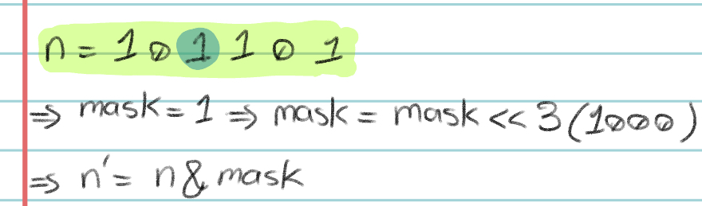
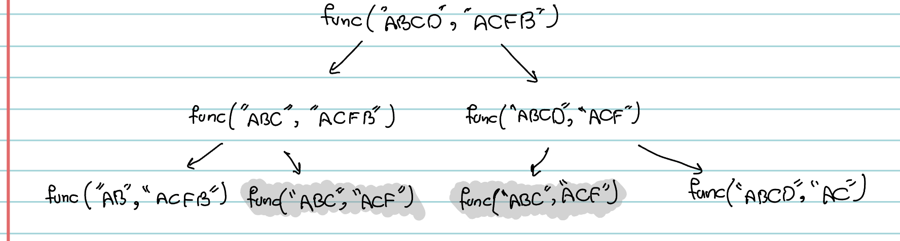

# My Problem Solving Submissions & Editorials #
Hello there! :smiley: If you're searching for a place to learn how to solve problems, and not just find the answers, then I have great news for you :sparkles: - you've come to the right place :books:! 

My name is Mohammadreza, and in this repository, I will do my best to explain my LeetCode submissions. I want to clarify that the solution I am sharing is not the only way to solve the problem, and perhaps **not the best** way! However, I believe it is easy to code, learn, and remember for future use. I'll share my thought process :thought_balloon: as I tackle a problem, and I'll help you follow the same procedure for similar questions. 

I suggest spending :hourglass: ***at least one hour*** :hourglass: trying to solve the problem yourself before checking out my editorial if you're unable to solve it. Doing so will help you understand better and improve your problem-solving skills after each attempt :chart_with_upwards_trend:. 

I hope that you find this repository helpful :white_check_mark:.

***

## My "General Procedure :trollface: " for Problem Solving ##
1. **DO NOT RUSH**:grey_exclamation:   It is important to read the problem description carefully and precisely, even when you are in a programming competition with a time limit. Rushing through the description can cause you to misunderstand the problem, and as a result, you may end up spending more time coding the wrong answer than it would take to figure out what the question really wants. Thus, taking your time to understand the problem is essential for success.
2. **Remeber** the similar problem 💡 **Remember** the idea 💡   This is the key step that helps you get the `Accepted`, and get better at problem-solving over time. After reading the problem description, start recalling similar questions you've solved before. Try to remember the idea you used to solve them and explain in one sentence why the current question requires a similar approach.
3. Challenge Acce......pted :heavy_check_mark:   Consider the constraints given in the problem description. Check the time limit and memory limit. Make sure the combination of your idea and the constraints satisfies the limits. By this point, you must have figured out how exactly this problem challenges you and what is your approach to tackling it. Do not ignore this. Only by doing this, you can make sure you are ready to start coding.
4. Code it and Get Accepted, then **THINK On It!** :shipit:   Once you've got the "Accept", there is one final step to complete. You need to come up with a label for the idea behind this problem. You don't have to only use formal or well-known labels like "DP" or "Greedy". Instead, use any label that will help you remember how you solved the problem in the future. By working through the problems in this repository, you'll become more familiar with this concept.
***

## Table of contents :page_facing_up:
(easy: :small_blue_diamond:, medium::small_orange_diamond:, hard::small_red_triangle:)
1. [LeetCode: Two Sum](#twosum) :small_blue_diamond: 
 
:dart:idea
  Two Pointers, Sort 

2. [LeetCode: Best Time to Buy and Sell Stock](#besttimetobuyandsellstock) :small_blue_diamond: 
 
:dart:idea
  Optimization, One Traverse 

3. [LeetCode: Contains Duplicate](#containsduplicate) :small_blue_diamond: 
 
:dart:idea
  Sort, big O 

4. [LeetCode: Product of Array Except Self](#productofarrayexceptself) :small_orange_diamond: 
 
:dart:idea
 Partial Sum 

5. [LeetCode: Maximum Subarray](#maximumsubarray) :small_orange_diamond: 
 
:dart:idea
 DP 

6. [LeetCode: Maximum Product Subarray](#maximumproductsubarray) :small_orange_diamond: 
 
:dart:idea
 DP, MaxSubarray 

7. [LeetCode: Find Minimum in Rotated Sorted Array](#findminimuminrotatedsortedarray) :small_orange_diamond: 
 
:dart:idea
 Binary Search 

8. [LeetCode: Search in Rotated Sorted Array](#searchinrotatedsortedarray) :small_orange_diamond: 
 
:dart:idea
 Binary Search, Rotated Problem 

9. [LeetCode: 3Sum](#threesum) :small_orange_diamond: 
 
:dart:idea
 Two Pointers, Sort 

10. [LeetCode: Container With Most Water](#containerwithmostwater) :small_orange_diamond: 
 
:dart:idea
 Two Pointers 

11. [LeetCode: Sum of Two Integers](#sumoftwointegers) :small_orange_diamond: 
 
:dart:idea
 Bit Manipulation 

12. [LeetCode: Number of 1 Bits](#numberof1bits) :small_blue_diamond: 
 
:dart:idea
 Bit Manipulation 

13. [LeetCode: Counting Bits](#countingbits) :small_orange_diamond: 
 
:dart:idea
 DP, Bit Manipulation 

14. [LeetCode: Missing Number](#missingnumber) :small_orange_diamond: 
 
:dart:idea
 Bit Manipulation, Math 

15. [LeetCode: Reverse Bits](#reversebits) :small_blue_diamond: 
 
:dart:idea
 BitMask 

16. [LeetCode: Climbing Stairs](#climbingstairs) :small_blue_diamond: 
 
:dart:idea
 DP, Last Actions 

17. [LeetCode: Coin Change](#coinchange) :small_orange_diamond: 
 
:dart:idea
 DP, Last Actions 

18. [LeetCode: Longest Increasing Subsequence](#longestincreasingsubsequence) :small_orange_diamond: 
 
:dart:idea
 DP, MaxSubarray 

19. [LeetCode: Longest Common Subsequence](#longestcommonsubsequence) :small_orange_diamond: 
 
:dart:idea
 DP, SFR, Last Actions 

***

### 1. LeetCode: Two Sum Problem [[Link]](https://leetcode.com/problems/two-sum/ "LeetCode Submission Link") 

#### Description

Given an array of integers `nums` and an integer `target`, return indices of the two numbers such that they add up to `target`.
You may assume that each input would have exactly one solution, and you may not use the same element twice.
You can return the answer in any order.

Example 1:   
Input: `nums = [2,7,11,15], target = 9`   
Output: `[0,1]`   Explanation: Because nums[0] + nums[1] == 9, we return [0, 1].   
Example 2:   
Input: `nums = [3,2,4], target = 6`   
Output: `[1,2]`   
Example 3:   
Input: `nums = [3,3], target = 6`   
Output: `[0,1]`

Constraints:   
2 $\le$ `nums.length` $\le$ 104  
-109 $\le$ `nums[i]` $\le$ 109   
-109 $\le$ `target` $\le$ 109   
+ Only one valid answer exists.

####

#### Editorial

It's natural to consider the approach of `brute force` when faced with this problem. Since the input array is not sorted, we need to scan the entire array for each element to find the other element that makes up the target. As a result, the time complexity of this approach would be $O(n^2)$. As we move on to the third step of my general approach, it becomes clear that this approach is bound to result in a time-limit error. Additionally, we have to keep track of the indexes of elements, which means any operation that moves and swaps the elements is a challenge.

Following the `brute force` idea, it would be great if we didn't have to walk through the entire array for each element  $O(n^2)$ . What does it require to find the answer only in one pass over the array $O(n)$ ? This means we can only perform one comparison for each element. However, the challenge is to determine the right element to calculate their sum and check if it matches the `target`. If the array was sorted, we could use the Two Pointer idea by having one pointer at the start and the other at the end of the array. By comparing their sum with the `target`, we could identify the next best pair to consider. For example, if their sum is less than the `target`, we would need to consider a pair with a larger sum, and by moving the pointer that points to the smaller element one step to the right, we can be sure that we have achieved the next larger sum available in the entire array.

Sorting an array of elements seems to be difficult if you also need to keep track of their indexes, but there is a simple solution to this problem. If you require both sorting and index tracking, you can pair each element with its index and then sort the resultant array of pairs. 

Although we need only $O(n)$ to traverse through the sorted array of pairs using Two Pointer, sorting the array itself requires a $O(n \  \ n)$. Still, this is good enough to get the `Accepted`.

##

### 2. LeetCode: Best Time to Buy and Sell Stock [[Link]](https://leetcode.com/problems/two-sum/](https://leetcode.com/problems/best-time-to-buy-and-sell-stock/) "LeetCode Submission Link") 

#### Description

You are given an array `prices` where `prices[i]` is the price of a given stock on the ith day.
  You want to maximize your profit by choosing a single day to buy one stock and choosing a different day in the future to sell that stock.   Return the maximum profit you can achieve from this transaction. If you cannot achieve any profit, return `0`.

Example 1:   
Input: `prices = [7,1,5,3,6,4]`   
Output: `5`   
Explanation: Buy on day 2 (price = 1) and sell on day 5 (price = 6), profit = 6-1 = 5.   
Note that buying on day 2 and selling on day 1 is not allowed because you must buy before you sell.   
Example 2:   
Input: `prices = [7,6,4,3,1]`   
Output: `0`   
Explanation: In this case, no transactions are done and the max profit = 0.
 
Constraints:   
1 $\le$ `prices.length` $\le$ 105   
0 $\le$ `prices[i]` $\le$ 104  

####

#### Editorial
We use the label "Optimization" to refer to problems that require finding the maximum, minimum, best, most, or similar terms. As soon as you identify a problem as an optimization problem, the first solution that should come to your mind is to solve it by traversing the array once. Sometimes, additional ideas like "DP" may be required to solve the problem during this traverse. At other times, the problem may be simpler than you initially thought.

This is an example of an easy problem where we need to find two elements from an array such that their difference is maximum. However, the order of these two elements matters. In fact, this is the only small challenge of this problem that the profit is calculated by subtracting the element with smaller index from the second element. Otherwise, by traversing the array only once, we can find the minimum and maximum element of the array, which would result in the maximum difference. 

To do this, as we traverse over the array, we must keep track of the minimum element seen so far, and calculate the global max profit as the maximum of itself and local profit which is the difference between the current element and the minimum element so far (which would be in the previous locations).

##

### 3. LeetCode: Contains Duplicate [[Link]](https://leetcode.com/problems/contains-duplicate/ "LeetCode Submission Link") 

#### Description

Given an integer array nums, return true if any value appears at least twice in the array, and return false if every element is distinct.
 
Example 1:  
Input: `nums = [1,2,3,1]`  
Output: `true`  
Example 2:  
Input: `nums = [1,2,3,4]`  
Output: `false`  
Example 3:  
Input: `nums = [1,1,1,3,3,4,3,2,4,2]`  
Output: `true`  

Constraints:  
1 $\le$ `nums.length` $\le$ 105  
-109 $\le$ `nums[i]` $\le$ 109  

####

#### Editorial

This is one of the simplest problems I have encountered on LeetCode. However, I wanted to include it in my repository because of the way I approached and solved it within 2 seconds. In many cases, you can arrive at the idea of solving a problem by considering the "big O" of the algorithm that would be accepted. For example, since the constraints allowed for $O(n\log \ n)$, I decided to use "Sort" as it is also $O(n\log \ n)$. If a problem requires $O(log \ n)$, then I would first consider "Binary Search" as it maps to $O(log \ n)$ in my mind. This is a helpful technique that you can use to figure out what idea to implement for the problem you are trying to solve.

If we sort the array ( $O(n\log \ n)$ ), all duplicate elements will become neighbors. Therefore, we can traverse the array once, and check if there exists an element that is equal to its neighbor. 

There are alternative techniques, such as utilizing "set" or ..., that may speed up the code. However, what I aimed to grasp from this problem, was to extract the idea from the big O the problem says it's fine to use.

##

### 4. LeetCode: Product of Array Except Self [[Link]](https://leetcode.com/problems/product-of-array-except-self/ "LeetCode Submission Link") 

#### Description

Given an integer array  nums , return an array `answer` such that `answer[i]` is equal to the product of all the elements of nums except `nums[i]`.  
The product of any prefix or suffix of nums is guaranteed to fit in a 32-bit integer.  
You must write an algorithm that runs in O(n) time and without using the division operation.

Example 1:  
Input: `nums = [1,2,3,4]`  
Output: `[24,12,8,6]`  
Example 2:  
Input: `nums = [-1,1,0,-3,3]`  
Output: `[0,0,9,0,0]`  
 
Constraints:  
2 $\le$ `nums.length` $\le$ 105  
-30 $\le$ `nums[i]` $\le$ 30  
The product of any prefix or suffix of nums is guaranteed to fit in a 32-bit integer.  

####

#### Editorial
This problem has three main challenges. First, the solution must have a runtime complexity of $O(n)$, which means we need to consider ideas like creating an extra array, traversing once over the `nums` array, or using dynamic programming. Secondly, the problem states that we cannot use the division operation. This means that we cannot find the product of the entire `nums` array and then divide the total product by each element. Instead, we must calculate the answer for each element `curr` by computing the product of the elements before and after `curr`. Finally, `0` is a tricky number in this problem. If there is exactly one `0` in `nums`, then the output will only have one non-zero element. If `nums` has more than one `0`, then the entire output will be zeros. Apart from these, this problem is pretty straightforward. However, the idea we use to solve it is quite useful and can be applied to many other problems.

"Partial Sum" refers to a general idea in which we create an array `ps`. Each `ps[i]` equals elements `arr[0]` to `arr[i-1]` of another array. I've used the partial sum idea in many problems. To solve this problem, we create two arrays: `pre` and `aft`. `pre[i]` is the product of `nums[0]` to `nums[i-1]`, while `aft[i]` is the product of `nums[i+1]` to `nums[last]` where `last` is the last element. To fill the output array, we multiply each element of `pre` with the corresponding element of `aft`. This algorithm has a runtime of $O(n)$ and handles the other two challenges mentioned.

##

### 5. LeetCode: Maximum Subarray [[Link]](https://leetcode.com/problems/maximum-subarray/ "LeetCode Submission Link") 

#### Description

Given an integer array nums, find the subarray with the largest sum, and return its sum.

Example 1:  
Input: `nums = [-2,1,-3,4,-1,2,1,-5,4]`  
Output: `6`  
Explanation: The subarray [4,-1,2,1] has the largest sum 6.  
Example 2:  
Input: `nums = [1]`  
Output: `1`  
Explanation: The subarray [1] has the largest sum 1.  
Example 3:  
Input: `nums = [5,4,-1,7,8]`  
Output: `23`  
Explanation: The subarray [5,4,-1,7,8] has the largest sum 23.  
 

Constraints:  
1 $\le$ `nums.length` $\le$ 105  
-104 $\le$ `nums[i]` $\le$ 104  

####

#### Editorial

This was one of the first "not easy" dynamic programming problems I solved, but it taught me a lot about this paradigm. The first step is to recognize it is a DP problem. How? Read the Dynamic Programming post [[Link]](https://github.com/mhdr-hami/Problem-Solving/blob/main/DynamicProgramming.md "Dynamic Programming post Link") . 

Solving the maximum subarray problem, like any other DP problem, can be challenging until you discover its "". To solve this problem, we need to determine the smaller or simpler form of the problem.  The key is to divide the solution into sub-groups and use them to solve the main problem. For example, one way to do this is to check if a subarray contains the element `nums[i]` or not. This makes sub-groups and helps us determine whether having an element in one subarray means anything or not. Another way is to consider any subarray that starts or ends with an element `nums[i]` for each element in `nums`.

The key to solving this problem is to group all subarrays based on their last element. Each group, denoted as `i`, includes all the subarrays that end with the element `nums[i]`. By determining the maximum sum of all subarray in each group as `dp[i]`, we can iterate through all of them and take their maximum as the solution.

Let's begin with `nums[0]`. The only subarray in the group of subarrays that ends with `nums[0]` is `nums[0]` itself. So, the first step is straightforward. `dp[0]` is equal to `nums[0]`. 

Next, the subarrays that end with `nums[1]` are the subarray `[nums[0], nums[1]]` and `nums[1]` itself. The maximum sum of elements among these two, which is `dp[1]`, is the greater value between `nums[0]+nums[1]` and `nums[1]`. To find a correlation between `dp[1]` and `dp[0]`, we can substitute `nums[0]` with `dp[0]` as they are equal. Thus, `dp[1]` is equal to the greater value between `dp[0]+nums[1]` and `nums[1]`.

From this, we may tackle how to find the DP secret. Assume we want to find `dp[n-1]` and we've already calculated `dp[n-2]`. Any subarray that ends with `nums[n-1]` is either `nums[n-1]` itself or a subarray in group `dp[n-2]` that `nums[n-1]` is added to it. Hence, the maximum sum in group `dp[n-1]` is either created by adding `nums[n-1]` to the answer of group `dp[n-2]` or by considering `nums[n-1]` by itself. That's it. We just found our DP secret. 

`dp[i] = max(nums[i]+dp[i-1], nums[i])`

All is left to do is to create the `dp` array, and take maximum element in that.

##

### 6. LeetCode: Maximum Product Subarray [[Link]](https://leetcode.com/problems/maximum-product-subarray/ "LeetCode Submission Link") 

#### Description

Given an integer array nums, find a subarray that has the largest product, and return the product.

The test cases are generated so that the answer will fit in a 32-bit integer.

Example 1:  
Input: `nums = [2,3,-2,4]`  
Output: `6`  
Explanation: [2,3] has the largest product 6.  
Example 2:  
Input: `nums = [-2,0,-1]`  
Output: `0`  
Explanation: The result cannot be 2, because [-2,-1] is not a subarray.  
 
Constraints:  
1 $\le$ `nums.length` $\le$ 2 * 104  
-10 $\le$ `nums[i]` $\le$ 10  
The product of any prefix or suffix of nums is guaranteed to fit in a 32-bit integer.  

####

#### Editorial

The first step is to recognize it is a DP problem. How? Read the Dynamic Programming post [[Link]](https://github.com/mhdr-hami/Problem-Solving/blob/main/DynamicProgramming.md "Dynamic Programming post Link") . Also, as the second step of "my general approach" suggests, we must think about a similar problem that we've solved before and we can easily determine that it is a very similar problem to the Maximum Subarray problem. So, What does this problem challenge us ("Third step")? Why can't we just modify the secret we found for the previous problem and use `dp[i] = max(nums[i]*dp[i-1], nums[i])`? As mentioned before, to figure out how to solve a problem, it is important to find what is the challenging part of that problem.

Let's consider the testcase where `nums=[-2,1,-1]`. When we use the modified secret, `dp` would be like `[-2, 1, 1]`. However, this would return `1` as the answer, which is incorrect. The problem arises because when we calculated dp[1], we compared `1` and `1*(-2)`, and kept `1` because it was larger. Then, when calculating `dp[2]`, we had already forgotten about the element `-2`, even though it plays an important role in the final answer. In this problem, negative numbers can be turned into large positive numbers just by being multiplied by `-1`. Therefore, the key is to create the same `dp` array, but keep both the minimum and maximum answers for each group `dp[i]`. Then, when calculating `dp[i+1]`, we would consider if the minimum answer of the previous group can also turn into the maximum of the current one. This is the DP secret of this problem.

`max_dp[i] = max(nums[i], max(nums[i]*max_dp[i-1], nums[i]*min_dp[i-1]))`  
`min_dp[i] = min(nums[i], min(nums[i]*max_dp[i-1], nums[i]*min_dp[i-1]))`

We're creating two `dp` arrays, one storing the minimum answer and one storing the maximum answer for each group and to create each, we need to also consider the other array too! Because the maximum answer of previous group can turn to minimum answer of current group and the minimum answer of previous group can turn to maximum answer of current group. All is left to do, is take the maximum of all elements in `max_dp`.  

##

### 7. LeetCode: Find Minimum in Rotated Sorted Array [[Link]](https://leetcode.com/problems/find-minimum-in-rotated-sorted-array/ "LeetCode Submission Link") 

#### Description

Suppose an array of length n sorted in ascending order is rotated between 1 and n times. For example, the array `nums = [0,1,2,4,5,6,7]` might become:  
`[4,5,6,7,0,1,2]` if it was rotated 4 times.  
`[0,1,2,4,5,6,7]` if it was rotated 7 times.  
Notice that rotating an array `[a[0], a[1], a[2], ..., a[n-1]]` 1 time results in the array `[a[n-1], a[0], a[1], a[2], ..., a[n-2]]`.

Given the sorted rotated array nums of unique elements, return the minimum element of this array.

You must write an algorithm that runs in O(log n) time.

Example 1:  
Input: `nums = [3,4,5,1,2]`  
Output: `1`  
Explanation: The original array was [1,2,3,4,5] rotated 3 times.  
Example 2:  
Input: `nums = [4,5,6,7,0,1,2]`  
Output: `0`  
Explanation: The original array was [0,1,2,4,5,6,7] and it was rotated 4 times.  
Example 3:  
Input: `nums = [11,13,15,17]`  
Output: `11`  
Explanation: The original array was [11,13,15,17] and it was rotated 4 times.  
 

Constraints:  
`n` == `nums.length`  
1 $\le$ `n` $\le$ 5000  
-5000 $\le$ `nums[i]` $\le$ 5000  
All the integers of nums are unique.  
`nums` is sorted and rotated between 1 and n times.

####

#### Editorial

We have a array that created from one or two sorted subarrays and the problem description says we have to find an algorithm that runs in $O(log \ n)$. Knowing all this, it's hard not to think about binary search. 

What we must do is to search for the first element that is not larger than `nums[0]`. because if an element is larger than `nums[0]`, it means it is a part of the first sorted subarray (note that we only have one break in the `nums`). All is left is literaly binary search. If `nums[mid]` $>$ `nums[0]`, then `mid` is before the break, and we must move the `low` to after it. Otherwise, we might have found the answer but to make sure it is the minimum element, we move the `high` to one element before the `mid`. 

##

### 8. LeetCode: Search in Rotated Sorted Array [[Link]](https://leetcode.com/problems/search-in-rotated-sorted-array/ "LeetCode Submission Link") 

#### Description

There is an integer array `nums` sorted in ascending order (with distinct values).

Prior to being passed to your function, nums is possibly rotated at an unknown pivot index `k` (`1 <= k < nums.length`) such that the resulting array is `[nums[k], nums[k+1], ..., nums[n-1], nums[0], nums[1], ..., nums[k-1]]` (0-indexed). For example, `[0,1,2,4,5,6,7]` might be rotated at pivot index 3 and become `[4,5,6,7,0,1,2]`.

Given the array `nums` after the possible rotation and an integer `target`, return the index of target if it is in `nums`, or `-1` if it is not in `nums`.

You must write an algorithm with O(log n) runtime complexity.

Example 1:  
Input: `nums = [4,5,6,7,0,1,2]`, `target = 0`  
Output: `4`  
Example 2:  
Input: `nums = [4,5,6,7,0,1,2]`, `target = 3`  
Output: `-1`  
Example 3:  
Input: `nums = [1]`, `target = 0` 
Output: `-1`  
 

Constraints:  
1 $\le$ `nums.length` $\le$ 5000  
-104 $\le$ `nums[i]` $\le$ 104  
All values of `nums` are unique.  
nums is an ascending array that is possibly rotated.  
-104 $\le$ `target` $\le$ 104  

####

#### Editorial

This is a very similar problem to the Find Minimum in Rotated Sorted Array problem. The main idea is to find the break using the idea we discussed before. After that, we have two sorted arrays and we know for each of them where it starts and ends. And the `target` is in one of them. How easy a problem can be :smirk:? 

##

### 9. LeetCode: 3Sum [[Link]](https://leetcode.com/problems/3sum/ "LeetCode Submission Link") 

#### Description

Given an integer array `nums`, return all the triplets `[nums[i], nums[j], nums[k]]` such that `i != j`, `i != k`, and `j != k`, and `nums[i] + nums[j] + nums[k] == 0`.

Notice that the solution set must not contain duplicate triplets.

Example 1:  
Input: `nums = [-1,0,1,2,-1,-4]`  
Output: `[[-1,-1,2],[-1,0,1]]`  
Explanation:   
nums[0] + nums[1] + nums[2] = (-1) + 0 + 1 = 0.  
nums[1] + nums[2] + nums[4] = 0 + 1 + (-1) = 0.  
nums[0] + nums[3] + nums[4] = (-1) + 2 + (-1) = 0.  
The distinct triplets are [-1,0,1] and [-1,-1,2].  
Notice that the order of the output and the order of the triplets does not matter.  
Example 2:  
Input: `nums = [0,1,1]`  
Output: `[]`  
Explanation: The only possible triplet does not sum up to 0.  
Example 3:  
Input: `nums = [0,0,0]`  
Output: `[[0,0,0]]`  
Explanation: The only possible triplet sums up to 0.  

Constraints:  
3 $\le$ `nums.length` $\le$ 3000  
-105 $\le$ `nums[i]` $\le$ 105  

####

#### Editorial

As per the second step of "my general approach", we recall that we have previously solved a similar problem, which also had a similar name "two sum". Therefore, our initial attempt should be to apply the same idea, which is to use Two Pointers. This problem was quite important for me as it helped me gain a better understanding of how to use the Two Pointers approach properly.

Let's discuss my first attempt at using the Two Pointers technique, which **DID NOT** result in getting an `accepted` solution. But I believe it's good to mention and learn from that.

Since we need to search for a third element, and sorting `nums` does not conflict with what the problem requires, I sorted the `nums`. Next, I set `pointer1` at the beginning and `pointer2` at the end of the `sorted_nums`. This left me with only searching for the third element in the range of elements between these two pointers.

If no third element was found, and `nums[pointer1] + nums[pointer2] > 0`, then we can safely decrease `pointer2` by one, as there are no two elements small enough to create the zero, with `pointer2` included. Similarly, if no third element was found, and `nums[pointer1] + nums[pointer2] < 0`, then we can safely increase `pointer1` by one, as there are no two elements big enough to create the zero, with `pointer1` included. However, things get tricky when we find the third element. The question we need to ask ourselves is what is the right thing to do in this case? Do we move `pointer1`, `pointer2`, both, or none? There is no right answer to this question, and this is the crucial key to using the Two Pointers technique. When moving a pointer, we must guarantee that this is the right decision to make; otherwise, we are not using this technique correctly.

To solve the problem, we need to loop through the `sorted_nums`. For each element `i`, we set `pointer1` to `i+1` and `pointer2` to the end of the `sorted_nums` array. Then, we check if the sum of these three elements is zero. If it is, we append them to the solution set. If the sum is greater than zero, we decrease `pointer2`, and if it's less than zero, we increase `pointer1`. We continue doing this for all elements in the array while ensuring that we move each pointer correctly. Also, this approach guarantees that we consider all possible triplets. The only downside to this method is that it has a runtime of $O(n^2)$, which is not an issue as range of values of `n` is small. However, there may be more efficient solutions available.

##

### 10. LeetCode: Container With Most Water [[Link]](https://leetcode.com/problems/container-with-most-water/ "LeetCode Submission Link") 

#### Description

You are given an integer array height of length `n`. There are `n` vertical lines drawn such that the two endpoints of the `i`th line are `(i, 0)` and `(i, height[i])`.  
Find two lines that together with the x-axis form a container, such that the container contains the most water.  
Return the maximum amount of water a container can store.  
Notice that you may not slant the container.  

Example 1:  

Input: `height = [1,8,6,2,5,4,8,3,7]`  
Output: `49`  
Explanation: The above vertical lines are represented by array [1,8,6,2,5,4,8,3,7]. In this case, the max area of water (blue section) the container can contain is 49.  
Example 2:  
Input: `height = [1,1]`  
Output: `1`  
 
Constraints:  
`n == height.length`  
2 $\le$ `n` $\le$ 105  
0 $\le$ `height[i]` $\le$ 104  

####

#### Editorial

Upon reading the problem description, the first idea that came to mind was using the Two Pointers approach. Although this idea may stem from solving previous problems, I believe there is a pattern in problems that can be solved using this approach. Generally, `(1)` in Two Pointer problems, we need to find a set of elements that fulfill certain constraints through searching. This set of elements in the array can be a pair, a triplet, or even a subarray. Two Sum and 3Sum problems are two examples of this case. `(2)` Usually, the Two Pointer approach is used when the array is sorted. `(3)` However, the most important aspect of this approach (as in this problem) is to avoid nested loops and take advantage of having two pointers. `(4)` We need to find the logic and ensure the correctness of moving each pointer, which allows us to solve the problem more efficiently. These 4 bullet points are the keys I am going to use from now on to recognize and solve the Two Pointer problems.

In this problem, we are looking for a pair of heights that together with the x-axis form a container, such that the container contains the most water (1). One naive solution is to use bruteforce and compare all of the existing containers but that would be $O(n^2)$ and we can be more efficient(3). So all is left to do is to find the logic of moving the pointers and guarantee its correctness (4). 

To find the largest container, we set `pointer1` to the first element and `pointer2` to the last element of the `height` array. We calculate the area of the container created by these two pointers and compare it to the `globalMax` we store at each step. Then we move one of the pointers. If `height[pointer1] < height[pointer2]`, we increase `pointer1`, otherwise, we decrease `pointer2`. 

The width of the next container is decreased by moving each pointer closer to each other. The height of the next container is equal to `min(height[pointer1], height[pointer2])`. To find a larger container, we need to change the `min` of these two pointers. For example, if `height[pointer1] < height[pointer2]`, the height of our container is `height[pointer1]`. By moving `pointer2`, we either reach a `new_pointer2 > pointer2` which does not result in finding a larger container, or `new_pointer2 < pointer2` and `new_pointer2 > pointer1`, which again does not result in finding a larger container, or `new_pointer2 < pointer1`, which results in finding a smaller container as it has a smaller height now. Therefore, it is guaranteed that if there exists a larger container, it can only be found by moving the pointer with the smaller height.

##

### 11. LeetCode: Sum of Two Integers [[Link]](https://leetcode.com/problems/sum-of-two-integers/ "LeetCode Submission Link") 

#### Description

Given two integers `a` and `b`, return the sum of the two integers without using the operators `+` and `-`.

Example 1:  
Input: `a = 1`, `b = 2`  
Output: `3`  
Example 2:  
Input: `a = 2`, `b = 3`  
Output: `5`  

Constraints:  
-1000 $\le$ `a`, `b` $\le$ 1000

####

#### Editorial

We have to solve this problem using bitwise operations as we are not allowed to use operators `+` and `-`. Given two binary numbers `a` and `b`, we either can use `a & b`, `a | b`, or `a ^ b`. Also, we can apply `<<`, `>>`, or `~`  on each binary number. As someone who has no idea what to do, I start by taking a numeric example and playing with the operators I have. Consider `a=1101` and `b=0011`. `a & b = 0001`, `a | b = 1111`, and `a ^ b == 1110`. Next, by considering these three, I try to understand what each one of them is (or at least, what it looks like it is). `a & b = 0001`, so it seems like `a & b` returns the carry we would have if we could apply the `+` operator. Also, `a ^ b = 1110`, which is similar to what we would have if we ignored considering the carry in calculating their sum. What I get from this, is I must shift the carry (as we do regularly in `+`) and add it to the sum without carry (`a ^ b`).

So I should use a recursive function, and pass these two as parameters of the function we call inside. As the base case, we know we pass the carry as the second parameter, and we do not always have the carry, which means finally second parameter `b` would be zero and we can return `a` as the answer of that sum. 

I know this editorial may seem a bit confusing and if you haven't seen a similar problem, the chance of finding the idea is not that much. But as you play with different numbers and walk through this editorial, it will make more sense for you and it may be useful for your future problem solving. 

##

### 12. LeetCode: Number of 1 Bits [[Link]](https://leetcode.com/problems/number-of-1-bits/ "LeetCode Submission Link") 

#### Description

Write a function that takes the binary representation of a positive integer and returns the number of 
set bits it has (also known as the Hamming weight).

Example 1:  
Input: `n = 11`  
Output: `3`  
Explanation:  
The input binary string 1011 has a total of three set bits.  
Example 2:  
Input: `n = 128`  
Output: `1`  
Explanation:  
The input binary string 10000000 has a total of one set bit.  
Example 3:  
Input: `n = 2147483645`  
Output: `30`  
Explanation:  
The input binary string 1111111111111111111111111111101 has a total of thirty set bits.  

Constraints:  
1 $\le$ `n` $\le$ 231 - 1  

####

#### Editorial

The idea of thir problem is also a bit tricky and maybe hard to come to mind similar to the previous problem.
To count the number of `1`s in a series of `1`s and `0`s, we must iterate through the series and increase the counter each time we see a `1`. Although we may not be able to exactly this, but we can use intuition behind it. 

It would be great if we could find an operation (or a sequence of operations) that would get rid of only one bit of `1` in a number. Then, we could keep doing this and as the number is getting smaller (its `1`s are disappearing), this procedure would stop when the number gets equal to zero. Now, let's take a look at what happens to the binary presentation of a number `n`, when we modify it `n-1`. If `n=1100`, then `n-1=1011`. If `n=1010100`, then `n-1=1010011`. by taking a closer look, we find out that by subtracting `1` from `n`, the right most set bit in `n` changes to zero any other bit `x` to its right changes to `~x`. So by taking `&` operation of `n` and `n-1`, we would only change one set bit (the rigt most set bit) of `n` to zero and the rest of bits to the left of that set bit remain unchanged (`x&x=x` and `x&~x=0`). If `n=1(1)[00]`, then `n-1=1(0)[11]`, and `n&(n-1)=1(0)[00]`. If `n=1010(1)[00]`, then `n-1=1010(0)[11]`, and `n&(n-1)=1010(0)[00]`. This approach has runtime of $O(log \ n)$ as it must iterate through the number of digits in the binary representation of a number.

##

### 13. LeetCode: Counting Bits [[Link]](https://leetcode.com/problems/counting-bits/ "LeetCode Submission Link") 

#### Description

Given an integer `n`, return an array `ans` of length `n + 1` such that for each `i` (0 <= `i` <= n), `ans[i]` is the number of `1`'s in the binary representation of `i`.

Example 1:  
Input: `n = 2`  
Output: `[0,1,1]`  
Explanation:  
0 --> 0  
1 --> 1  
2 --> 10  
Example 2:  
Input: `n = 5`  
Output: `[0,1,1,2,1,2]`  
Explanation:  
0 --> 0  
1 --> 1  
2 --> 10  
3 --> 11  
4 --> 100  
5 --> 101  
 
Constraints:  
0 $\le$ `n` $\le$ 105  

####

#### Editorial

We remember we have solved the "Number of 1 Bits" before. As that approach has a good runtime of $O(log \ n)$, even calling that function for each element i between 1 and n would result in a runtime of $O(n \ log \ n)$ which is good enough. But we're about to challenge ourselves and try to solve this problem using DP with a runtime of $O(n)$.

We create the array `dp` such that `dp[i]` is the number of `1 bit`s in the number `i`. Now, it's time to find the secret of this DP. Consider any arbitrary binary number like `n=11001`. We aim to find a relationship between the number of `1 bit`s in `n` and any number smaller than `n` that we have stored its answer in `dp`. By deleting the leftmost `1 bit` in `n=11001`, we can get a smaller number `n'=1001`. Now the question is how to get to `n'` from `n`. Deleting the leftmost `1 bit` from a number means subtracting the biggest power of 2 from that number. Hence, all that is left to do is to keep track of the biggest power of 2 while filling the `dp` and we know a power of 2 has a binary representation of one `1 bit` at the left and some `0 bit`s to its right.

and here is our DP secret:  
`dp[i] = dp[i-maxPower]+1`

Here is a trick that we learned from the "Number of 1 Bits" problem. We know `n&(n-1)` removes the rightmost `1 bit` and keeps the rest of `1 bit`s unchanged. So if a number `n` is a power of 2, meaning its binary representation is in the form of one `1 bit` at the left and some `0 bit`s to its right, `n&(n-1)` must be zero. This is a very interesting trick that only with one bitwise operation, you can check if a number is a power of two or not.

##

### 14. LeetCode: Missing Number [[Link]](https://leetcode.com/problems/missing-number/ "LeetCode Submission Link") 

#### Description

Given an array `nums` containing `n` distinct numbers in the range `[0, n]`, return the only number in the range that is missing from the array.

Example 1:  
Input: `nums = [3,0,1]`  
Output: `2`  
Explanation: n = 3 since there are 3 numbers, so all numbers are in the range [0,3]. 2 is the missing number in the range since it does not appear in nums.  
Example 2:  
Input: `nums = [0,1]`  
Output: `2`  
Explanation: n = 2 since there are 2 numbers, so all numbers are in the range [0,2]. 2 is the missing number in the range since it does not appear in nums.  
Example 3:  
Input: `nums = [9,6,4,2,3,5,7,0,1]`  
Output: `8`  
Explanation: n = 9 since there are 9 numbers, so all numbers are in the range [0,9]. 8 is the missing number in the range since it does not appear in nums.  

Constraints:  
`n` == `nums.length`  
1 $\le$ `n` $\le$ 104  
0 $\le$ `nums[i]` $\le$ `n`  
All the numbers of nums are unique.  

####

#### Editorial

There exists an easy $O(n \ log \ n)$ approach, which is to sort the `nums`, loop through it and check which number what is the first number that is missing. We can make use a faster approach with a runtime of $O(n)$, which to calculate the sum of all elements in `nums`, and then compare it to `n*(n+1)/2` which is the sum of all elements without any missing number. By comparing these two we can find the missing number.

But, there exist another approach (maybe faster?) that only uses xor operation. We know `x^x=0`. So if xor all the elements in `nums`, and then xor the result with all the numbers from `0` to `n`, we would have a large sequence, in which each number appears twice except one. So we eliminate all the pairs of numbers and the only number remaining (which is the final result of the xor sequence) is the answer. 

##

### 15. LeetCode: Reverse Bits [[Link]](https://leetcode.com/problems/reverse-bits/ "LeetCode Submission Link") 

#### Description

Reverse bits of a given 32 bits unsigned integer.

Note:  
Note that in some languages, such as Java, there is no unsigned integer type. In this case, both input and output will be given as a signed integer type. They should not affect your implementation, as the integer's internal binary representation is the same, whether it is signed or unsigned.  
In Java, the compiler represents the signed integers using 2's complement notation. Therefore, in Example 2 above, the input represents the signed integer -3 and the output represents the signed integer -1073741825.

Example 1:  
Input: `n = 00000010100101000001111010011100`  
Output:    `964176192` (`00111001011110000010100101000000`)  
Explanation: The input binary string 00000010100101000001111010011100 represents the unsigned integer 43261596, so return 964176192 which its binary representation is 00111001011110000010100101000000.  
Example 2:  
Input: `n = 11111111111111111111111111111101`  
Output:   `3221225471` (`10111111111111111111111111111111`)  
Explanation: The input binary string 11111111111111111111111111111101 represents the unsigned integer 4294967293, so return 3221225471 which its binary representation is 10111111111111111111111111111111.
 
Constraints:  
The input `must` be a binary string of length 32

####

#### Editorial

This is a simple problem that can be solved using various methods. However, I came across the solution provided by [LHearen](https://leetcode.com/u/LHearen/ "LHearen Leetcode Account") on his Leetcode account and found his bitmasking approach to be quite interesting. I think it would be helpful to share it with you, as it is a straightforward and easy-to-understand approach that can be applied to many other problems.

First, let's review different bitmasking operations in C++.  
+ Setting a specific bit:  
  - By setting a specific bit, we mean changing that bit to `1` without touching other bits. For instance, if `n=10[0]101`, and we want to set the fourth LSB (Least-Significant-Bit), we should generate `n'=10[1]101`. To do that, we start with a single bit `1`, we shift it to the location we want to set, and then we perform a bitwise OR.   

  
+ Clearing a soecific bit:  
  - By clearing a specific bit, we mean changing that bit to `0` without touching other bits. For instance, if `n=10[1]101`, and we want to clear the fourth LSB (Least-Significant-Bit), we should generate `n'=10[0]101`. To do that, we start with a single bit `1`, we shift it to the location we want to clear, and then we perform a bitwise NOT to toggle all the bits and finally we perform a bitwise AND.   

  
+ Toggling a soecific bit:  
  - By toggling a specific bit, we mean changing a bit to `0` if it is `1`, and changing it to `1` if it is `0` without touching other bits. For instance, if `n=10[1]101`, and we want to toggle the fourth LSB (Least-Significant-Bit), we should generate `n'=10[0]101`. To do that, we start with a single bit `1`, we shift it to the location we want to toggle, and then we perform a bitwise XOR.   

  
+ Checking if a specific bit is set or not:  
  - In this operation, we check if a specific bit is set or not without touching any one of the bits. For instance, if `n=10[1]101`, and we want to check if the fourth LSB (Least-Significant-Bit) is set or not. To do that, we start with a single bit `1`, we shift it to the location we want to check, and then we perform a bitwise AND. That specific bit is set, if `n'` is `1`.   

  

Now, let's get back to this problem. We want to generate a binary number `reverse` that is the reverse bits of a given binary number `n`. To do that, we create a 32 bits binary variable `mask` that only its MSB (Most-Significant-Bit) is set. Following that, we check if the LSB of `n` is set. If it is, we should set the MSB of the `reverse` too and we can do that by performing a bitwise OR. Then we shift both `mask` and `n` one to the right to check the next LSB in `n`.

##

### 16. LeetCode: Climbing Stairs [[Link]](https://leetcode.com/problems/climbing-stairs/ "LeetCode Submission Link") 

#### Description

You are climbing a staircase. It takes `n` steps to reach the top.  
Each time you can either climb `1` or `2` steps. In how many distinct ways can you climb to the top?

Example 1:  
Input: `n = 2`  
Output: `2`  
Explanation: There are two ways to climb to the top.  
1. 1 step + 1 step  
2. 2 steps  
Example 2:  
Input: `n = 3`  
Output: `3`  
Explanation: There are three ways to climb to the top.  
1. 1 step + 1 step + 1 step  
2. 1 step + 2 steps  
3. 2 steps + 1 step  
 
Constraints:  
1 $\le$ `n` $\le$ 45  

####

#### Editorial

The first step is to recognize it is a DP problem. How? Read the Dynamic Programming post [[Link]](https://github.com/mhdr-hami/Problem-Solving/blob/main/DynamicProgramming.md "Dynamic Programming post Link") . In general, dynamic programming is applicable when tackling problems that involve determining the number of ways to accomplish a task, finding the maximum or minimum quantity of something, or situations where breaking down a problem's outcome into results from its prior steps is feasible. Similarly, problems that can be decomposed into smaller, more manageable subproblems are also indicative of dynamic programming as a potential solution strategy.

Next, we must try to break the problem to find the DP secret. The process of breaking a problem starts with considering the final answer to the problem. Of course, we don't know its value, but we can think about how it can be generated. The question is how we can break the process of finding the answer into smaller or simpler steps that we can solve, memorize(DP), and use to get the final answer. One easy way of doing this, is to consider the last actions we could take, to reach the final step of the solution. Following from now, we'll cal this the "last actions" trick.

The question is how many distinct ways there are to reach the top step. Let's utilize the "last actions" trick we just mentioned. In any distinct way of reaching the top step, your last action must be either `take 1 step` or `take 2 steps`. Additionally, these actions do not affect the number of ways we could reach the previous steps. Therefore, we can remember the answer for previous steps and use the last two steps to find the answer. And here is our DP secret:
`dp[i] = dp[i-1] + dp[i-2]`

##

### 17. LeetCode: Coin Change [[Link]](https://leetcode.com/problems/coin-change/ "LeetCode Submission Link") 

#### Description

You are given an integer array `coins` representing coins of different denominations and an integer `amount` representing a total amount of money.  
Return the fewest number of coins that you need to make up that amount. If that amount of money cannot be made up by any combination of the coins, return `-1`.  
You may assume that you have an infinite number of each kind of coin.  

Example 1:  
Input: `coins = [1,2,5]`, `amount = 11`  
Output: `3`  
Explanation: 11 = 5 + 5 + 1  
Example 2:  
Input: `coins = [2]`, `amount = 3`  
Output: `-1`  
Example 3:  
Input: `coins = [1]`, `amount = 0`  
Output: `0`  

Constraints:  
1 $\le$ `coins.length` $\le$ 12  
1 $\le$ `coins[i]` $\le$ 231 - 1  
0 $\le$ `amount` $\le$ 104  

####

#### Editorial

We figure out this problem can be solved using DP, as it asks for the fewest number of ways to achieve a goal. One useful strategy is to use the "last action" trick, which involves solving the main problem using the answers of smaller problems (in this case, any amount smaller than `amount`). To break the problem into smaller and simpler pieces, we can focus on just one of these coins, denoted as `c`. By removing `c`, we achieve a smaller amount (`amount - c`), and using buttom-up approach, we must know `x`, as the fewest number of coins needed to make up that `amount - c`. As we took out only one coin, the answer for `amount` would be `x+1`.

But, we have different coins and by taking out each coin, we end up to a different smaller acount with a different answer. Which one should we take out? As we need to find the fewest number of coins, we must consider taking out all of the coins one by one, and find the one that results in a smaller answer for `amount`. This is our DP secret. 

`dp[i] = dp[i-coins[c]] + 1`   where `dp[i-coins[c]` is the minimum `dp[i-coins[j]` one among all the coins `j`. 

##

### 18. LeetCode: Longest Increasing Subsequence [[Link]](https://leetcode.com/problems/longest-increasing-subsequence/ "LeetCode Submission Link") 

#### Description

Given an integer array `nums`, return the length of the longest strictly increasing
subsequence.

Example 1:  
Input: `nums = [10,9,2,5,3,7,101,18]`  
Output: `4`  
Explanation: The longest increasing subsequence is [2,3,7,101], therefore the length is 4.  
Example 2:  
Input: `nums = [0,1,0,3,2,3]`  
Output: `4`  
Example 3:  
Input: `nums = [7,7,7,7,7,7,7]`  
Output: `1`  

Constraints:  
1 $\le$ `nums.length` $\le$ 2500  
-104 $\le$ `nums[i]` $\le$ 104  

####

#### Editorial

Longest + subsequence => Let's try DP first. Without extra explaination, let's get into finding the DP secret.   Since we are searching for a subsequence in an array, we can apply the main idea from the MaxSubArray problem that we have previously solved. The approach involves considering the last element of all existing subarrays. Any solution subarray (subsequence) ends with one of the elements in `nums`. Therefore, we can break the problem by looping through each element `nums[i]`, checking all the subarrays that end with that element, and storing the best answer for each (`dp[i]`). Finally, we can take the maximum of the stored answers to obtain the final solution.

To find the DP secret, we need to determine how to assign a value to `dp[i]` using previous elements in `dp[]`. We know that `dp[i]` represents the length of the longest increasing subsequence that ends with element `nums[i]`. Therefore, `nums[i]` is a part of this subsequence and must be greater than the second last element of that subsequence (the element that comes before `nums[i]`). Thus, all that's left is to loop through all elements `nums[j]` (`j` $<$ `i`) where `nums[j]` $<$ `nums[i]`, and select the one with the maximum value of `dp[j]` to find the length of the longest subsequence (`dp[i]`) for the current `i`. And here is our DP secret:
`dp[i] = dp[j] + 1` where `nums[j]` $<$ `nums[i]` && `dp[j] + 1` $>$ `dp[i]`

##

### 19. LeetCode: Longest Common Subsequence [[Link]](https://leetcode.com/problems/longest-common-subsequence/ "LeetCode Submission Link") 

#### Description

Given two strings `text1` and `text2`, return the length of their longest common subsequence. If there is no common subsequence, return `0`.  
A subsequence of a string is a new string generated from the original string with some characters (can be none) deleted without changing the relative order of the remaining characters. For example, `"ace"` is a subsequence of `"abcde"`.  
A common subsequence of two strings is a subsequence that is common to both strings.

 

Example 1:  
Input: `text1 = "abcde"`, `text2 = "ace"`  
Output: `3`   
Explanation: The longest common subsequence is "ace" and its length is 3.  
Example 2:   
Input: `text1 = "abc"`, `text2 = "abc"`  
Output: `3`  
Explanation: The longest common subsequence is "abc" and its length is 3.  
Example 3:  
Input: `text1 = "abc"`, `text2 = "def"`  
Output: `0`  
Explanation: There is no such common subsequence, so the result is 0.
 

Constraints:  
1 $\le$ `text1.length`, `text2.length` $\le$ 1000  
`text1` and `text2` consist of only lowercase English characters.

####

#### Editorial

Longest + subsequence => DP. When we begin to tackle DP, it's important to recognize that this problem differs from others we've solved using DP. In this case, we are going to learn a new technique for uncovering the DP secret, which I call "SFR" or "Start From Recursive". When you're unable to directly find the DP secret and are stuck, this approach can be quite useful. You start by attempting to solve the problem using the "Recursive" approach and then convert it to "Memoization" (recursive + a `dp[]` array to store results). Following that, you can also attempt using the "Tabulation" method (the technique we've been using so far, which I prefer over memoization due to its intuitive nature).

Consider two strings `text1` and `text2`. Always remember to think simply and go step by step. To find a common subsequence, we must consider single characters in two strings and check with a structure. As we may not find the DP secret right away, we start by trying to solve it using the recursive approach. The recursive function must take two strings `text1` and `text2` as input, call the function inside itself for smaller strings, and return the length of the longest common subsequence. The idea would be to check the last character of the two input strings. If they are the same characters, it means this character is a part of the common subsequence, so we can move on to return `1+ func(text1 - lastChar1, text2 - lastChar2)` (where `lastChar1` == `lastChar2`) strings. If the last character of two strings is not the same, as we want the length of the **longest** common subsequence and we don't know which `lastChar` we should ignore, we consider both scenarios and return `max(func(text1 - lastChar1, text2), func(text1, text2 - lastChar2)`. The base case is when at least one of the input strings is empty which we return `0`.

Next, we draw the tree the recursuve function creates, to understand what is going on. This tree is an example for two input strings "ABCD" and "ACFB".  

